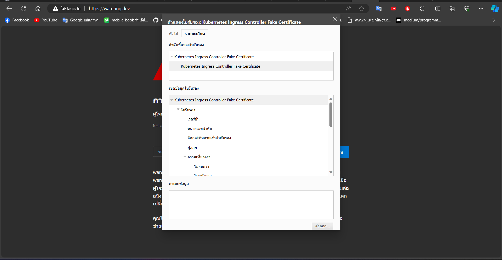
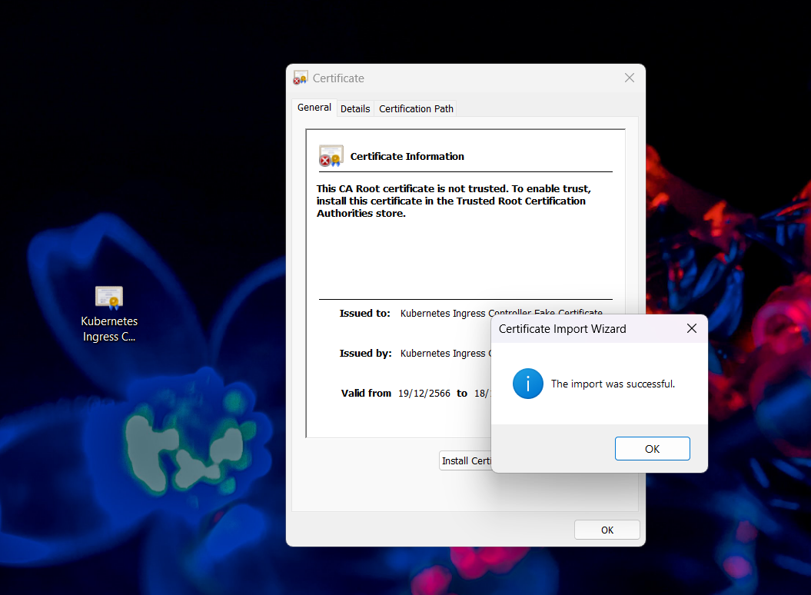
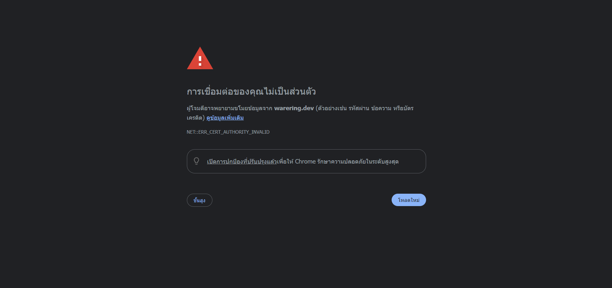

### skaffold
install Skaffold

> https://skaffold.dev/docs/install/

running Skaffold


> skaffold dev
### Installation ingress-nginx
> https://kubernetes.github.io/ingress-nginx/deploy/#quick-start

### Add host
path file
> C:\Windows\System32\drivers\etc\hosts

Add 
> 127.0.0.1 WareRing.dev

### Install Certificate



### Your connection is not private.
พิมพ์ thisisunsafe บน browser

### K8s

Create a accessing Secrete

```bash
kubectl create secret generic jwt-secret --from-literal=JWT_KEY=HelloWorld
```

Get secret

```bash
 kubectl get secrets
```

Add Env in a PPod

```code
apiVersion: apps/v1
kind: Deployment
metadata:
 name: auth-depl
spec:
 replicas: 1
 selector:
   matchLabels:
     app: auth
 template:
   metadata:
     labels:
       app: auth
   spec:
     containers:
       - name: auth
         image: sekkarin/auth
+         env:
+           - name: JWT_KEY
+             valueFrom:
+               secretKeyRef:
+                 name: jwt-secret
+                 key: JWT_KEY
```

### TEST

1 jest test

2 test mongodb in memory

3 supertest make fake requests to my express app

4 run assertions to make the request did the right thing

```bash
npm  i --save-dev @types/jest @types/
supertest jest ts-jest supertest mongod
b-memory-server
```
5 chagne flag in a Dockerfile

--omit=dev  ละเว้น package dev

--only=prod เฉพาะ package prod

```code
FROM node:alpine
 
WORKDIR /app
COPY package.json .
RUN npm install --only=prod //changed
COPY . .
 
CMD ["npm", "start"]
```

### Git update Version package.json
```bash
npm version patch 
```
### Sharing code by NPM organization
1. create account
2. create organization
3. initialize package.json
4. npm login
5. npm publish --access public
6. npm publish